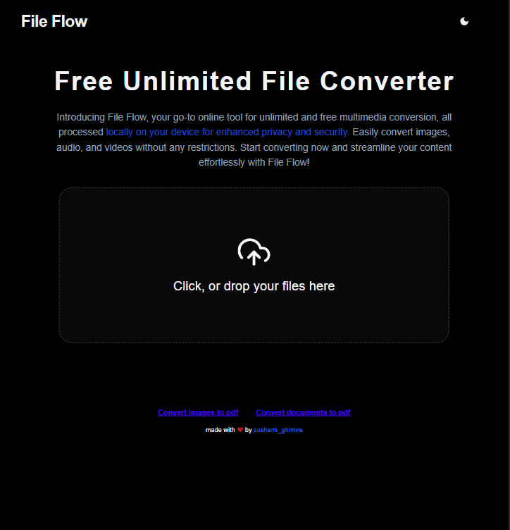

# FileConverter

A robust application for converting files, supporting multiple image formats. This project simplifies file conversions with a clean, responsive interface. Built using **Next.js**, **TypeScript**, **FFmpeg**, and **TailwindCSS**, it allows users to upload files directly from their local device and convert them seamlessly.

## Features

- **Image Conversion**: Upload images from your local device and convert them to other formats effortlessly.
- **Landing Page**: A visually appealing introduction to the app.
- **Conversion Page**: Intuitive UI for uploading and converting files.
- **Responsive Design**: Optimized for all device types using TailwindCSS.
- **Efficient Processing**: Powered by FFmpeg for high-quality conversions.

## Tech Stack

- **Framework**: Next.js
- **Language**: TypeScript
- **Styling**: TailwindCSS
- **Media Processing**: FFmpeg

## Images

Below are screenshots of the application:

### Landing Page



### Conversion Page


### Document Conversion Page


## Installation

1. Clone the repository:

   ```bash
   git clone https://github.com/Sushank-ghimire/fileconverter.git
   cd fileconverter
   ```

2. Install dependencies:

   ```bash
   npm install
   ```

3. Set up FFmpeg:

   - Download and install FFmpeg from [FFmpeg.org](https://ffmpeg.org/download.html).
   - Ensure it is added to your system's PATH.

4. Start the development server:

   ```bash
   npm run dev
   ```

5. Access the app at: [http://localhost:3000](http://localhost:3000)

## Usage

1. Open the **Landing Page** to understand the app's features and functionality.
2. Navigate to the **Conversion Page** to upload an image file from your local device.
3. Select the desired output format.
4. Click **Convert** and download the converted file.

## Contribution

Contributions are welcome! To contribute:

1. Fork the repository.
2. Create a new branch: `git checkout -b feature-name`.
3. Make your changes and commit: `git commit -m "Description of changes"`.
4. Push to the branch: `git push origin feature-name`.
5. Open a pull request.

## License

This project is licensed under the [MIT License](LICENSE).

---

Built with ❤️ by [Sushank Ghimire](https://github.com/Sushank-ghimire).
